# Weekly Learning
This documents the main things I learned this week.
- "Confidence" means that I moved into a deeper understanding and consistent implementation in an area.
- "Awareness" means I have an understanding of this topic, but am not fully practiced in it.
- 

## Current March 10-14
- Profiling the threads in an app
  - Sometimes you need to see all the activity running on each thread in an app. For our mobile app, we can do this...
  - `dotnet-trace` for MAUI https://github.com/dotnet/maui/wiki/Profiling-.NET-MAUI-Apps#ios-mac-etc
  - run the tracer 
  - do your activity
  - stop the tracer which exports to json file somewhere
  - drop the json file into www.speedscope.app
  - 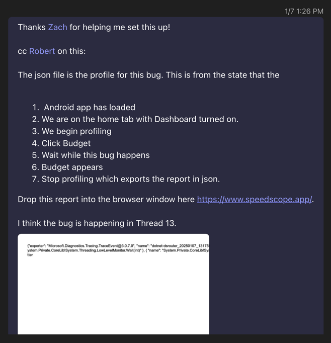
- Monitor network requests with HTTP Toolkit
  - https://httptoolkit.com/
  - Attach to a device

## Feb 17-21
- Automation Ids and xaml string interpolation
  - `AutomationId="{Binding GroupAmountAutomationId, StringFormat='{0}Details', FallbackValue='GroupAmount'}"`
  - The `StringFormat` allows you to format the string before it is output
  - The `{0}` grabs the 0 indexed parameter (the Binding) and puts it into the string. The rest concatenates to it.
- Full Screen Grid and SafeArea
  - For whatever stupid reason, a Grid's background WILL overflow the SafeArea on iOS, but the content inside the grid will NOT, unless it is given `IgnoreSafeArea="True"`

## Feb 10-14
- Set up a new virtual Android device to debug on
  - Open Android Studio
  - More Actions > Virtual Device Manager
  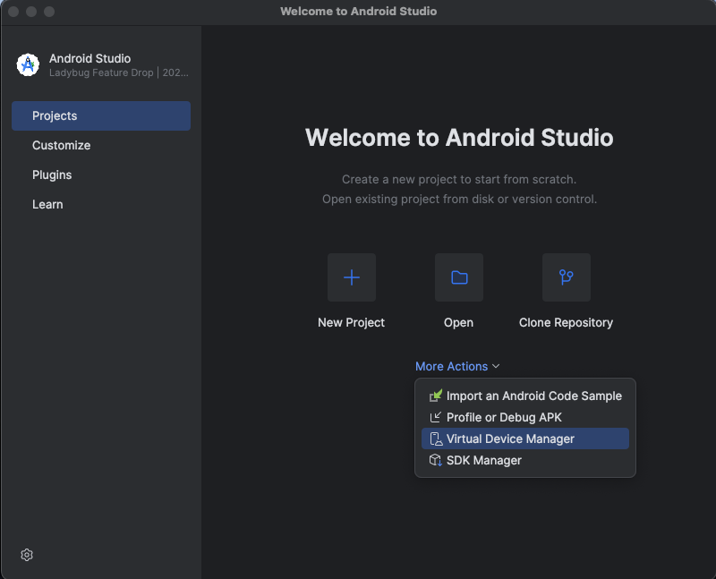
  - "+"
  - Select the Device you want
  - Click Next to dl sdk.
  - May have to restart IDE or emulator a couple times.
- Maui sucks
  - on iOS, something is really buggy with show/hide logic and rendering.
  - sometimes setting different properties will fix it.
- Azure runs our CI/CD pipelines. Integrated with Github.
- 

## Jan 6-10
- Profiling in .NET MAUI
  - Overview: https://github.com/dotnet/maui/wiki/Profiling-.NET-MAUI-Apps
  - Android: https://github.com/dotnet/android/blob/main/Documentation/guides/tracing.md
  - VSCode: https://marketplace.visualstudio.com/items?itemName=nromanov.dotnet-meteor
  - Speedscope (for reading output json files): https://www.speedscope.app/
- SyncFusion Budget Lag Bug
  - The SyncFusion control is just shitty at rendering things.
  - When the view is drawn (even though it haas all the data), SyncFusion does some kind of redrawing loop that causes a lot of lag.
  - [VirtualListView](https://github.com/Redth/Maui.VirtualListView) is a good alternative, but we need to remove SyncFusion and then build our own swipe-to-delete, drag-drop, and reorder behaviors within it. That's a lot of work.

## Dec 16-20
- HTTP request watching using [HTTP Toolkit](https://httptoolkit.com/docs/guides/ios/)
- Azure Pipelines GitLab Token Refresh
  - Azure Pipelines doesn't actually run EveryDollar tests. Instead, it triggers the tests to run in GitLab, then monitors and reports the progress.
  - Because of this, Azure needs a GitLab token to be able to log in.
  - Occasionally, that token needs to be refreshed. I'm not sure who sends it, but Zack Dean alerted me to it.
  - Log into Azure/RamseySolutions/Ramsey Plus/Pipelines
  - Library/Mobile Automation/Variable Group/GITLAB_ACCESS_TOKEN
  - Paste new token and save
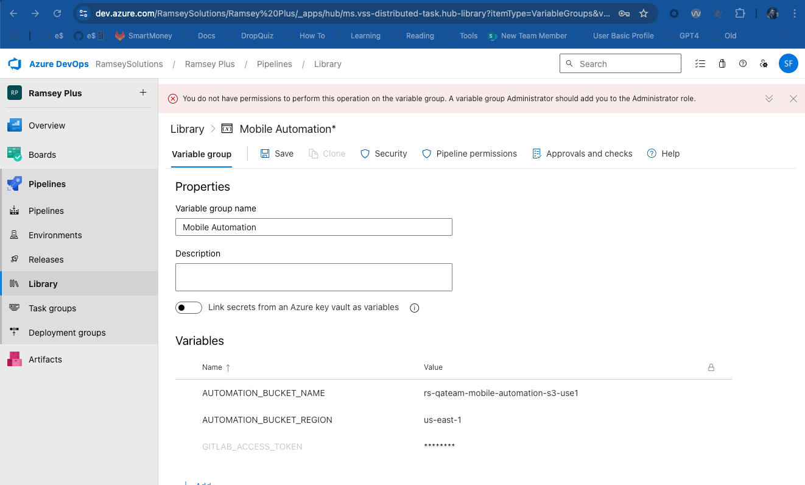

## Dec 9-13
- Azure
  - Pipelines. I can make a QA build from ANY branch. Useful if I want to debug something.
- Runway
  - Allows you an easy way to download builds onto a physical device
- Console (XCode)
  - Can show logs and activity on a physical device.

## Dec 2 - 6
- `reflog`
  - I did a bad squash, merge and rebase. Reflog shows you EVERYTHING that has happened on that branch.
  - 

## Nov 25-29
- Dynatrace Query
  - Log into correct environment.
  - Logs & Events Classic
  - ```bash
    fetch logs
    | filter matchesValue(service.name, "everydollar-web-bff") and contains(content, "bonus_entry")
    | sort timestamp desc
    | fields timestamp, message
    ```
  - Couple things to note
    - `fetch logs` returns every log for every event in every repo
    - `content` contains can be very broad and useful!
    - ACTIONS => Export csv
  - Loggly Query
    - ```bash
      tag:"env-qa" json.app_id:"education-solutions.ramsey-education" json.request_controller:"Api::BonusEntryController" json.response_status:"400" json.request_parameters:"{"referral_code":"zinfandel","entry_type":"everydollar_livestream_account_bonus","controller":"api/bonus_entry","action":"create","bonus_entry":{"entry_type":"everydollar_livestream_account_bonus"}}" json.request_parameters:"{"referral_code":"zinfandel","entry_type":"everydollar_livestream_account_bonus","controller":"api/bonus_entry","action":"create","bonus_entry":{"entry_type":"everydollar_livestream_account_bonus"}}" json.request_parameters:"{"referral_code":"zinfandel","entry_type":"everydollar_livestream_account_bonus","controller":"api/bonus_entry","action":"create","bonus_entry":{"entry_type":"everydollar_livestream_account_bonus"}}"
      ```
    - That's just ugly, but what can you do.

## Nov 18-22
- Java
  - Annotations: More black magic than rails. Add @WhateverAnnotation above the code you want to pass to it. It acts like
  a wrapping function or something. @Async @Params, and tons of others. You just need to know the docs around them to know
  what they are doing though.
- Session
  - Session can persist before and after log in which is pretty cool.
  - We shoved a referral code from a query parameter into session before login, then after login (when it was stripped away),
  we pulled it back down to forward it after log-in/registration to associate an account creation with a referral code.
- Query Params
  - Very useful. Anything can be added as long as `/endpoint?referral_code=a2x9sy&?source=paid-ad`


## Oct 28 - Nov 1
- Void
  - void makes sense now. If I have a method that triggers a property to change, then the method call doesn't actually return
  anything. Instead, the method just changes a property. So it would be void.
- MAUI Lifecycles
  - Page has `OnAppearing()` and `OnDisappearing` in the code-behind of the xaml page.
  - viewModels can run something from the constructor when they initialize.
  - Of course viewModels should themselves listen to the state of their models and automatically update if they are subscribed.
- E$ has high walls between domains to keep spaghetti code from forming.
- Squash/Merge before rebase
  - Here's the deal...if you try to rebase against master, the rebase process goes through each one of your commits on your branch
  and looks for merge conflicts starting with your first commit. If there is a conflict on one commit, you fix it, then the next commit
  will have a conflict that will need to be fixed. Pain in the ass.
  - Fix it by squashing all your commits into one commit.
  - `git log` to see how many commits you have total before someone else's shows up. Example, 3 commits, and Jerry's was the 4th.
  - `git rebase -i HEAD~[n]` where [n] is the number of commits including the one before yours (just in case). The `-i` flag allows
  you to use an IDE to step-by-step fix it.
  - In the IDE, you'll see a list of commits like this:
```bash
pick 1e0a396 Update dependency gts to v6
pick 6af09d3 RPLUS-66540 Add migration status to get budget call
pick b6ae46a Fix migration status fetching
pick fd2b3fd If migration status fails, default to false
pick af38086 [Slack] Deserialize UnitFilterRule attributes and operators into enum values
pick 795b9c6 Added Debug Logs to log in the Spring Boot app
pick 6f88408 [RPLUS-71603] Add copy of Unit Filtering JSON with changes to current units
pick 2c4cb6b [RPLUS-71599] Add new handoff units to unit filtering JSON
```
  - `pick` means "preserve this as a commit"
  - `s` or probably `squash` means "take all the stuff in this commit, and squash it into the next commit above it."
  - `r` means "pick this, but rename it when I'm done"
```bash
r 1e0a396 Update dependency gts to v6
s 6af09d3 RPLUS-66540 Add migration status to get budget call
s b6ae46a Fix migration status fetching
s fd2b3fd If migration status fails, default to false
pick af38086 [Slack] Deserialize UnitFilterRule attributes and operators into enum values
pick 795b9c6 Added Debug Logs to log in the Spring Boot app
pick 6f88408 [RPLUS-71603] Add copy of Unit Filtering JSON with changes to current units
pick 2c4cb6b [RPLUS-71599] Add new handoff units to unit filtering JSON 
```
  - In the above example, the oldest commit is picked, followed by the next 3. Then "fd2b3fd If migration status fails, default to false"the latest commit "1e0a396 Update dependency gts to v6" will be the main single commit that I will squash the other
is squashed up into the next which is then squashed up again until we get to `r` which receives the squashing of all the others into itself
and will then allow me to reword.
  - Once that is all done
    - `git checkout master`
    - `git pull`
    - `git checkout -`
    - `git rebase master -i`
    - Resolve merge conflicts
    - `git push --force`

## Oct 14-18
- Docker
  - `mvn clean verify` on mobile-bff would not run. It couldn't find the container. Basically, that was a lie.
  It could find the container, but it was not able to authenticate. I had to check Administrative Access in Rancher Desktop
  preferences.
  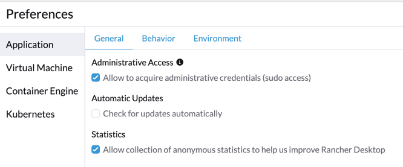
  - I thought I had a conflict with it pointing to postgresql, but that wasn't it.
  - In the future, if I do have a conflict, here are some useful commands.
  - `brew services list` lists all the running services (instances of postgres).
  - `brew services start/stop postgresql@16` start or stop a specific postgres services
  - `docker context ls`
  - `docker ps`
  - `docker info`
  - `ramsey docker-login` logs into the ecr (Elastic Container Registry) which acts like a source of truth for the code.
  This is shortcut to the more elaborate command: `aws ecr get-login-password --region us-east-1 | docker login --username AWS --password-stdin 058238361356.dkr.ecr.us-east-1.amazonaws.com`
  But this can also be gotten at by going to ECR on web, logging in, finding repositories, clicking it, and getting push command.
  - `docker ps` then `docker kill whateverSerialNumber`
  - `docker image/container/volume prune` remove unused image/container/volumes (I freed up 42 gigs).
- Running BFF or back end for front end locally.
  - To point the app to the local bff, in `appsettings.local.json`, uncomment localhost and comment out 433.

## August 5-9
- Tooling in EveryDollar
  - Azure error when trying to build:
    - There were random build errors around Azure. I had to delete the `bin` and `obj`.
    - Wipe Strider down and start clean with `rivendell` `alias rivendell='rm -rf ~/.nuget/packages && rm -rf **/bin **/obj'`
    - Reinstall workloads for maui: `sudo dotnet workload install maui ios maui-android maui-ios --no-cache --source https://api.nuget.org/v3/index.json`
    - Invalidate caches in Strider.
    - `dotnet restore --interactive`
    - `dotnet build`
    - Log into Azure dev ops from the website.
    - When I start Strider there was a dialogue, I don't recall what, to log in to Azure DevOps and get a code.

## July 15-19
- Spring Framework
  - Spring manages objext instances and their lifecycles.
  - It can do this through singleton beans, prototype beans, and other scopes.
  - It provides a wrapper to manage them which is called the Spring context.
  - It provides database connectivity / data access
    - connect
    - query
    - transaction management
  - It does this all through a handy API instead of using the **painful** JDBC provided by stock Java.
  - It provides Spring MVC for web applications.
- Beans
  - A bean is an object that is instantiated, assembled (through factory pattern), and managed by a Spring container.
  - Instead of having class A create class B, Spring can create class B and inject it into class A.
  - `@Bean` annotation is used above a method to declare that it returns a bean. It registers the method's return value as a bean.
- Coupling
  - Tight coupling is when two classes are dependent on each other. If one changes, the other has to change. Very bad.
  - Loose coupling with interfaces is when two classes are dependent on an interface. If one changes, the other doesn't have to change. Very good.
  - Loose coupling with Spring is when two classes are dependent on the Spring container. If one changes, the other doesn't have to change. Very good.

## July 1-5
- .Net Maui
  - This work for Recommendation: https://github.com/lampo/everydollar-mobile-app/pull/4124
  - Relay command annotation for building commands without all the nasty boilerplate.
  ```csharp
    [RelayCommand]
    private async Task CommitAsync(CancellationToken token)
    {
      await MoveToNextRecommendationAsync(token);
    } 
  ```
  - Add an event listener in the constructor, and then dispose of it in the dispose method.
  ```csharp
    public RecommendationsViewModel()
    {
      this.PropertyChanged += this.OnPropertyChanged;
    }

    public void Dispose()
    {
      this.PropertyChanged -= this.OnPropertyChanged;
    }
  ```
  - Organizing code:
```csharp
using EveryDollar.SmartMoney.Models.Prompts;

namespace EveryDollar.Guides.Modalities;

[XamlCompilation(XamlCompilationOptions.Compile)]
public sealed partial class BinaryModality : ModalityBaseView<ISingleQuestionPromptModel>
{
  // private static here
  
  // private readonly here

  // private fields go here

  public BinaryModality()
  {
    this.InitializeComponent();
  }
  
  // all public properties
  
  // all private properties
  
  // public methods
  
  // protected methods

  protected override void Dispose(bool disposing)
  {
    if (disposing)
    {
      this.QuestionViewRef.Dispose();
    }

    base.Dispose(disposing);
  }

  protected override void Setup()
  {
    if (this.unitViewModel.Prompt is ISingleQuestionPromptModel singleQuestionPromptModel)
    {
      this.QuestionViewRef.BindingContext = singleQuestionPromptModel.Question;
      this.QuestionViewRef.GoToNextPromptCommand = this.unitViewModel.SubmitAsync;
    }
  }
  
  // private methods
}
```

## June 24-28
- Starting `ramsey-plus-smartmoney-api`
  - Build the project: `mvn clean verify` to compile, build, and run tests.
  - Start local database `docker-compose up` (make sure you `docker compose down` when finished).
  - Start the AWS thingy: Leapp => `ramsey-plus-test`
  - Seed the database with a script `./seed_data.sh`
  - Start the project in IDE

## Get it running

`docker compose up -d`

### User Profile Service
[everydollar-user-profile-service](https://gitlab.com/ramsey-solutions/ramsey-plus/everydollar/everydollar-user-profile-service/)


### SmartMoney API 
[ramsey-smartmoney-api](https://gitlab.com/ramsey-solutions/ramsey-plus/ramsey-plus-smartmoney-api)


### Mobile App
[everydollar-mobile-app](https://github.com/lampo/everydollar-mobile-app)


## June 17-21
- Local SSH keys
  - SSH keys are used to authenticate a user to a server like Gitlab. It's a way for Gitlab to recognize my computer so I don't have to enter my password every time I push or pull.
  - Generate an SSH key on your local machine: 
    - `ssh-keygen -t rsa -b 4096 -C your_email@example.com`
  - Skip the passphrase by hitting enter twice.
  - Add your apple keychain to your private key so you don't have to enter your password every time you push or pull from Gitlab 
    - `ssh-add --apple-use-keychain ~/.ssh/id_rsa`
  - View the public (`.pub`) key you just made: 
    - `cat ~/.ssh/id_rsa.pub`
    - It should start with `ssh-rsa` and end with your email.
  - Copy the key and paste it into Gitlab under `Settings > SSH Keys`
  - Do a test pull or push to see if it works.
- Accessibility
  - `aria-live` watches whatever element you attach it to and the screen reader will read it out loud whenever it changes. I used it to make the parent element with the aria-label
  read its updated label which was changed whenever a sub-element of a checkbox was clicked or toggled. That way, the user doesn't have to leave the checkbox to hear the updated label.
  - tabindex="0" makes an element focusable. tabindex="-1" makes it focusable programmatically, but not by the user.
- Running packages locally in a consuming app.
  You can run your consuming app and point it to your local version of this package, but you may have React version conflicts. To remedy this, follow these steps:

  1. Build `financial-wellness-task-ui-engine` package: `yarn run build`
  2. Remove the `node_modules/financial-wellness-task-ui` directory in the consuming app: `rm -rf node_modules/financial-wellness-task-ui`
  3. Create a new `node_modules/financial-wellness-task-ui` directory in the consuming app: `mkdir node_modules/financial-wellness-task-ui`
  4. Copy the `dist` directory from the `financial-wellness-task-ui-engine` package to the new `node_modules/financial-wellness-task-ui` directory in the consuming app: `cp -R ../financial-wellness-task-ui-engine/dist ./`
  5. Copy the `package.json` file from the `financial-wellness-task-ui-engine` package to the new `node_modules/financial-wellness-task-ui` directory in the consuming app: `cp ../financial-wellness-task-ui-engine/package.json ./`
  6. Run the consuming app

  These steps will need to be repeated each time you make changes to the javascript in the `financial-wellness-task-ui-engine` package.

  Below is a handy bash script to automate these steps (assuming your package and your consuming app are in the same directory):

```bash
  alias tasker='cd ../financial-wellness-task-ui-engine && yarn run build && cd - && rm -rf node_modules/financial-wellness-task-ui && mkdir node_modules/financial-wellness-task-ui && cd node_modules/financial-wellness-task-ui && cp -R ../../../financial-wellness-task-ui-engine/dist ./ && cp ../../../financial-wellness-task-ui-engine/package.json ./ && cd -'
```

## May 13-17
- Merging two branches together before either aregit  merged into master.
  - 

## May 6-10
- Tailwind
  - hover and active.
  - I'm getting good at it.
- Coaching
  - We have a terribly way of associating coaches with people in SmartDollar.
- Database work
  - Tomas and I did more database work
- Authentication
  - Passport.js is a middleware for Node.js that can be used for authentication.
  - 

## Apr 29 - May 3
- URLs
  - You can run JavaScript in Pendo! We use it to add a utm parameter to the URL which is then shared to mobile desktop so we can track opens from icon vs web visits.
  - UTM parameters are used to track the effectiveness of marketing campaigns. They are added to the end of a URL like `?utm_source=facebook&utm_medium=cpc&utm_campaign=summer_sale`
  - JavaScript to add to the parameter and GO is `window.location.href = window.location.href + "?utm_source=mobile-desktop-icon"`
  - JavaScript to add to the parameter and STAY is `window.history.pushState({}, "", window.location.href + "?utm_source=mobile-desktop-icon")`
  - Pendo tries to run the JS over and over. So have to do a hard

## Week:Apr 15- 19
- Develop branch
  - Merge your branch into the develop branch to test on the web
  - `git checkout master`
  - `git pull`
  - `git checkout develop`
  - `git reset --hard origin/master` To force parity of develop with master
  - `git rebase your-branch`
  - `git push --force`
  - Let it build
  - Check status in [Go Pipelines Smartdollar-App_develop](https://websystems.ramseysolutions.net/go/tab/pipeline/history/smartdollar-app_develop)
  - Open in https://www.test.smartdollar.com/app/dashboard
- Building
  - Tailwind
    - Tailwind needs to be run every time a change happens to your css.
    - It builds your css file by scanning your project and generating the css for it.
    - This can be done with the command line `npx tailwindcss -i ./src/input.css -o ./src/output.css"`
    - This script can also be aliased in the package.json:
    ```json
    { 
    "scripts": {
      "test": "jest",
      "build": "npx tailwindcss -i ./src/input.css -o ./src/output.css"
      }
    }
    ```
    - Gotta make sure its looking at all your files though (finicky) in `tailwind.config.js`
    ```js
    /** @type {import('tailwindcss').Config} */
    export default {
      content: [
        "./src/**/*.html",
        "./src/**/*.js"
      ],
      theme: {
          extend: {},
      },
      plugins: [],
    }
    ```
    - Nodemon
      - The constant `crtl + c` `node .` every time I make a change sucks.
      - I can use `nodemon` to watch for changes and restart the server automatically.
    - Running it all together
      - I want to automatically rebuild my css and and restart my server when I make changes.
      - `package.json` script: `"start": "nodemon --watch src --ext js,html,css --exec \"npm run build && node .\""`

## Mar 4 - 8
- Testing
  - Feature Tests tests behavior on a page like clicking a button and seeing if the page changes.
  - System Tests are very similar. They are where Ruby 5 is going. They are more versatile and can test more things like JavaScript.
  - It is easy to spot Feature and System tests by seeing `visit` with an endpoint, `click_on` with a button, or `fill_in` with a form,
  and `expect(page).to have_content` with a string.
  - A bad use for a feature test is testing the content on a page and that's it. It doesn't make sense to spin up a whole page just to assert
  that something shows up. Better to test the behavior on the page and whether things change based on the behavior.
  - Unit tests are easy to spot because they instantiate a class and test a method.
- Deep Linking, OneLink, and other stuff. (Deep Linking is a way to link to a specific page in an app. It's like a URL for an app.)
  - OneLink via AppsFlyer
    - OneLink is a way to create a deep link that works across platforms. It's like a URL for an app that works on both iOS and Android.
    - We use OneLink.me created through AppsFlyer.
    - AppsFlyer is a tool that tracks user behavior in the app.
    - AppsFlyer is going away with EveryDollar Maui upgrade.
    - Knowledge experts are Olivia Nitzsche, Chris Simeone (who built many onelinks), Ivan Portugal (great general knowledge), Meg and media team
      (for starting accounts in AppsFlyer), Aaron Eversole (who would know if there's a need to do other methods of deep linking).
    - OneLink templates are built in appsflyer.
    - AppsFlyer has the DATA tracking for the onelinks generated with it.
    - Deeplinking is fickle.
    - SmartDollar uses Braze for deep linking as well.
    - SmartDollar uses logic to provide a web link or the onelink based on the device. The OneLink does NOT decide whether to open in browser or app.
    Rather, it only decides which app to open (iphone or android, or appstore/playstore).
    - Drawbacks
      - Limited on mobile...Can only open the app. Can't open a specific page in the app.
      - AppsFlyer data is suspect. Olivia doesn't fully trust it.
      - May be going away with Maui upgrade in 2 weeks.
      - Links sometimes not working as expected.
      - There are many many complicated factors which go into the final destination of the link, such as device, browser, os, email vs browser, etc.
      - Seen more "bugs" in yahoo and safari.
  - Apple Associated Domains: https://<fully qualified domain>/.well-known/apple-app-site-association
    - Add a json file to the root of the domain. It's like a sitemap for the app. It tells the app where to go when it sees a link to the domain.
    - Documentation: https://developer.apple.com/documentation/xcode/supporting-associated-domains
    - Examples
      - Reddit: https://reddit.com/.well-known/apple-app-site-association
      - Best Buy: https://bestbuy.com/.well-known/apple-app-site-association
      - Lyft: https://lyft.com/.well-known/apple-app-site-association
      - Netflix: https://www.netflix.com/.well-known/apple-app-site-association
  - Android App Links: https://<fully qualified domain>/.well-known/assetlinks.json

## Feb 26 - Mar 1
- SmartDollar QA is live and publicly accessible at https://qa.smartdollar.com/app/dashboard
- Mobile features must be done with great care.
- If you have a gut feeling, speak up and make sure there's a contingency plan. It happened this week when we were going
to make a "quick 10 min change," but I felt it could go sideways. I spoke up and we agreed to merge janky code if things
went sideways. They did, and it was raised, "No no, we can fix it quick," but thankfully, we had a plan to roll it back 
and make a bug ticket. it worked out.
- The team moves slower on some things than I wish they would. When I'm in slack time, I want to fix little UI bugs. But it
has to go through the whole review process. So I feel trapped in having to find something else to do. 
- SOLID
  - S (Single Responsibility Principle) - A class should have only one reason to change...meaning, if you have to change a class
  for some reason, you only have to change one thing about it because it only does one thing. The anti-pattern here is like
  the User `God Object` we have in SmartDollar which does too many things.
  - O (Open/Closed Principle) - A class should be open for extension, but closed for modification. Like a TTRPG, the rules are closed
  for modification, but the adventure is open for extension. So for example, an Adventure class should be closed for modification,
  but a special subclass like `DungeonAdvanture < Adventure` is valid. It inherits from Adventure and extends it. It does not modify
  the `Adventure` class, it just adds to it to extend it's functionality.
  - L (Liskov Substitution Principle) - subclass objects should be able to be substituted for base class objects without issue.
  For example, if I want to call `levelUp` from a `Character` class, I should be able to do `Theif.levelUp` and `Bard.levelUp` just
  as easily as `Character.levelUp` because `Theif < Character` and `Bard < Character`. 
  - I (Interface Segregation Principle) - A class should not be forced to implement an interface it doesn't use.
  

## Feb 5th - 9th
- asdf
  - asdf is a CLI tool which manages multiple runtime versions. It's like nvm, but for multiple languages. when `asdf install` is run,
  it looks for a `.tool-versions` file in the current directory and installs the versions of the tools listed in it.
- 

## Jan 29 - Feb 2
- Dynatrace
  - Learned and wrote a [comprehensive tutorial](https://devtools-portal.ramseysolutions.net/docs/default/component/platform-engineering-documentation/dynatrace/emails_from_logs_tutorial/) 
  on how to set up a metric in Dynatrace from logs and use it to create an email alert.
  - Saw the business value of having a full-time Dynatrace dude on hand.

## January 15-19
- JavaScript
  - Array stuff for my bot to parse responses based on beginning and ends of code blocks
```js
async function parseAndReply(response, message) {
    let startingIndex = 0;
    let indexOfCodeBlockOpen = 0;
    let indexOfCodeBlockClose = 0;
    const backticks = "```"
    // returns -1 if no index found)
    while(response.indexOf(backticks, startingIndex) > 0){

        indexOfCodeBlockOpen = response.indexOf(backticks, startingIndex);
        // Adds response before the code block begins.
        await message.reply(response.slice(startingIndex, indexOfCodeBlockOpen));
            
        indexOfCodeBlockClose = response.indexOf(backticks, (indexOfCodeBlockOpen + 1)) + 2;
        
        await message.reply(response.slice(indexOfCodeBlockOpen, indexOfCodeBlockClose + 1));
        
        startingIndex = indexOfCodeBlockClose + 3;
        
        console.log("Starting Index: ", startingIndex);
    } 
    console.log("block open", response.indexOf(backticks, startingIndex))

    await message.reply(response.slice(startingIndex, response.length));
}
```

## Jan 8-12
- Red Dot Notification Logic
  - Tests are so important! I wrote my tests when it started getting too complicated to keep track of. Had failing tests
  which actually highlighted gaps in my understanding of the code base and helped to to strengthen my code.
  - Feature Tests break if network calls are not stubbed properly. Our side nav items all render for many feature tests.
  Because my red do requires a network call, it broke like 80 feature tests. I had to stub the network call in the `before do` block 
  for all 80 of those tests. This is a code smell.
  - Logic was great!
```ru
module Coaching
  class Indicator
    def initialize(target_date = DateTime.now)
      @target_date = target_date
    end

    attr_reader :target_date

    def show_indicator?
      return false if user_has_one_on_one? || indicator_cleared?

      optimizely_enabled? && valid_window_to_show_indicator?
    end

    def set_cleared_coaching_indicator_state
      return unless valid_window_to_show_indicator? || next_event_exists?

      if event_last_seen.nil?
        create_cleared_coaching_indicator_state
      else
        update_event_last_seen
      end
    end

  private

    def user_has_one_on_one?
      ProductVariant.current.can_access_one_on_one_coaching?
    end

    def valid_window_to_show_indicator?
      less_than_48_hours? || event_happening?
    end

    def less_than_48_hours?
      next_group_coaching_start_time - 48.hour < target_date
    end

    def event_happening?
      next_group_coaching_start_time <= target_date && target_date < next_group_coaching_end_time
    end

    def next_group_coaching_start_time
      DateTime.parse(Coaching::Events.next.starts_at)
    end

    def next_group_coaching_end_time
      DateTime.parse(Coaching::Events.next.ends_at)
    end

    def indicator_cleared?
      return false if event_last_seen.nil?

      event_last_seen.event_id == Coaching::Events.next.id
    end

    def event_last_seen
      ClearedCoachingIndicatorStates.find_by(user_external_id: User.current_user.external_id)
    end

    def create_cleared_coaching_indicator_state
      ClearedCoachingIndicatorStates.create(
        user_external_id: User.current_user.external_id,
        event_id: Coaching::Events.next.id
      )
    end

    def update_event_last_seen
      event_last_seen.update(event_id: Coaching::Events.next.id)
    end

    def next_event_exists?
      Coaching::Events.next.present?
    end

    def optimizely_enabled?
      Experiment::CoachingSideNavNotificationDot.enabled?
    end
  end
end
```

## January 1-5
DB
- I had a bunch of failing tests. Seems my local db was corrupted somehow. reset with `RAILS_ENV=test rails db:reset`

Model
- Model does CRUD operations on the db. 
- Model name is singular because it represents the single instantiated object.
- Provides access to fields in the db through accessor methods.
- Maps database rows into objects.

View Helpers
- Helps to keep view logic out of the main view file.
- Methods written in Ruby which can be called in the view. (if x then y)

Discord+GPT Bot
- Set up a Discord server and a bot.
- node runs a server.
- .env used for security. Stores tokens locally for development purposes, but .gitignore prevents them from being pushed
to GitHub where they could be publicly visible.
- Slash commands are specified then run the code associated with them. They need to be registered in the `deploy-commands.js` file
and then run in node to be sent to Discord.
- Substantive changes to a command should prompt you to run `node deploy-commands.js` to update the command in Discord.
- `.addStringOption` is used to add a string field in the Discord chat box. The user types and it is returned 
as the `interaction.options.getString('name')` where 'name' is the parameter of `option.SetName()`

Ruby
- `DateTime.parse(string)` can de-convert strings into DateTime objects.
- Module is portable so we can rip it out later...or it use it elsewhere 😜

RSpec in SmartDollar
- `include_context` has a bunch of really useful shortcuts for stubbing information like `enrolled_user` and `group_coaching`
- Stub requests just look like requests in the `before do` block.
- stubbing `DateTime.now` is important so the test never changes... `allow(DateTime).to receive(:now).and_return(DateTime.new(2022, 2, 8))`

Segment
- Segment tracks user behavior in the app.

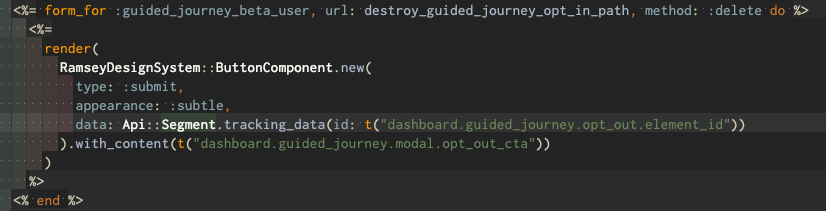 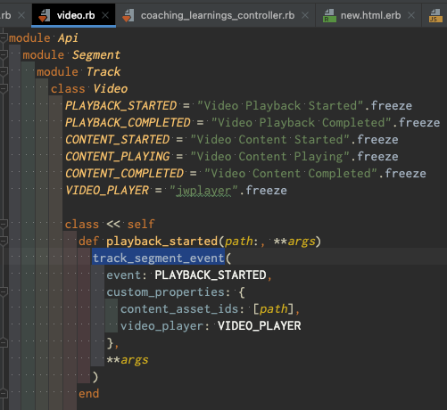

Optimizely (reference)
- need access
- experiment directory.
- create a flag for the experiment.
- got to optimizely, and create new flag.
- match name and key.
- auto creates in prod test and qa env.
- build the rule ADD RULE (a/b test usually)
- percentage usually 50/50.
- select metrics, add tracking code to all versions of your trigger both on and off.
- save ruleset
- copy rules from elsewhere.
- leave OFF in PROD until its time for Travis to turn it on.
- Turn on in qa and test for development and testing. (Takes a few minutes to start working).
- in Code. wrap your element in an if statement to turn on Optimizely.

## December 18-22
- ETL data processing: Used to consolidate data from multiple sources into a single source. `User-Basic-Profile` needs us
to do some ETL in SmartDollar with our customer data. We need to make sure the keys and values we send match what they expect.
  - Extract: Grab the data from somewhere
  - Transform: Change the data into the format you need
  - Load: Put it in a final destination
- Debugging Rails
  - binding.pry
- Artifactory
  - Creates an authoritative source for all packages and dependencies in projects. It ensures that all team members are working
  with the same tools and versions to speed up development and deployment in a CI/CD pipeline.
  - I was having trouble running `bundle install` because my Artifactory secret token had expired. Refreshed it and applied it.
- Set up environment
  - Found docs to set up SD.
  - Troubleshot Artifactory token issue and command line config.
  - Troubleshot a problem with local database reseed code in SmartDollar (its been broken for a while, but went unnoticed).
  [Fixed it with an MR](https://gitlab.com/ramsey-solutions/ramsey-plus/smartdollar/smartdollar-app/-/merge_requests/4292).

## December 11-15
- Debugging
  - I found an angle of a bug that I don't think anyone would have noticed. It will save a lot of time for whoever tries to fix it.
  - The bug only happens 3%-5% of the time when tests are run. A random test will fail. Since it only happens very rarely, its easy to think that
  the problem is with the test that failed. I discovered through running over and over that the bug actually causes a random test to fail.
  It probably has more to do with a shared dependency.
  - I was able to document it [thoroughly here](https://github.com/lampo/ramsey-plus-budget-app/issues/3063), knowing I'm setting the next guy up for success.
- Building
  - E$ prefers commands rather than Tapped property becuase the command has a lot of useful behavior on it (like restricting double clicks). 

## December 4 - 8
- Bigger Problems
  - I recognize that the "big stumpers" for me are "normal stumpers" for the team rather than being "no brainers" for the team.
  - The level of the problem I'm able to work on is much higher than it used to be and is aligning with the team.
- Lifecycle Events
  - Better to separate concerns by using lifecycle events rather than using a single event handler for multiple events. Too much to keep track of.
  - Fix one problem at a time. Don't try to get two-for-one... That's very unscientific. 👨‍🔬
  - For example, don't new up a component in the middle of a propertyChanged event which sets one of its properties. New it up and in separate method, and set the property in an OnPropertyChanged event.
- There's a Xamarin/iPhone routing bug. Just have to workaround it.
- Background Tasks
  - iPhone
    - [Apple BGTasks](https://developer.apple.com/videos/play/wwdc2019/707)
  - Android
  - .NET
    - [Options for .NET and Android](https://medium.com/nerd-for-tech/background-work-in-xamarin-forms-part-1-xamarin-android-63f629e73f9)
    - 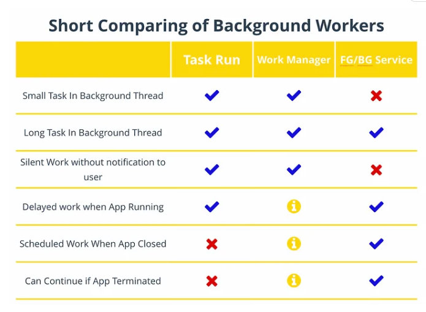

## November 27 - December 1
- Error Handling
  - try/catch
  - Event handlers
  - Lifecycle events (Page and ContentView)

## November 20 - 24
- Xamarin
  - Page and component lifecycles
- Time Estimation
  - Best estimate times three. Proves true.
- Thinking through Value Tradeoffs in Debugging
  - During debugging of a video player I was refactoring, I had to make some tough judgement calls about which route
  to take when trying to figure it out. Below, I'll recap the whole thinking process which essentially boiled down to:
  "This code looks right, so I either do exploratory debugging, or explore other reasons outside of my code." I'm glad 
  My gut told me it would be faster to survey other possibilities than to go on a rabbit hunt in the code. I'm glad I
  explored other options because it was a problem so outside the box that I would have never found it in the code.

### Thinking Process
The video player was playing videos properly on iOS, while Android only played visuals with no audio. This is how I approached it:
1. Considered possible reasons.
  * File Type: `m3u8` file type doesn't play nice with Android. I'd overheard two team members discussing the problems with `m3u8` files a couple weeks ago.
  * Streaming Service: streaming from that particular cms doesn't play nice with Android
  * Encoding: encoding of the particular video I picked doesn't play nice with Android.
  * My Code: My Android player is set up wrong in the code (maybe the async functions are out of order or something). 
2. I did a cursory investigation on StackOverflow and Google to see if anyone else ran into this. Several people had, but no definitive solutions were given.
3. My code looked good, so I had to choose between:
  * Deep dive into code on a rabbit hunt.
  * Ask a team member if the `m3u8` file is the problem
4. It was much faster to ask Dreiss about `m3u8` files than to go on a rabbit hunt.
5.  He said it was unlikely a problem with the `m3u8` file type.
6.  I then had to choose between:
  * Deep dive into code on a rabbit hunt.
  * Try out different file types and streaming services to see if they fixed the problem, so I could rule out my code as the issue.
7. I found several other links in different file types, and they all showed video with no audio.
8. I took a cursory re-look at my code, and everything seemed fine.
9. I then had to choose:
  * Deep dive into the code on a rabbit hunt.
  * Brainstorm some other possible problems.
10. I opened up my mind to other options, and it almost immediately occurred to me that the emulator itself might be the problem.
11. To test this, I would need to run the app on a physical device.
12. I got one set up, and the video and audio played just fine. The problem was with the emulator, not the code!

## November 13 - 17
- Resourceful
  - Figured out how to squash and merge one local branch into another with merge conflicts.
  - Figured out how to get a test suite running in a c# project that was targeting the wrong framework.
- Custom Control
- Time Management
  - "Good Ideas" can be bad ideas if they cost too much.
  - Get distracted, but don't get distracted from your distraction.

## November 6 - 10
- Xamarin
  - Custom Controls
    - Built two custom controls. One more complex than the other.
    - XAML supplies a value to `Animal` like `Animal="Frog"`, and they get a card with the name and animal image.

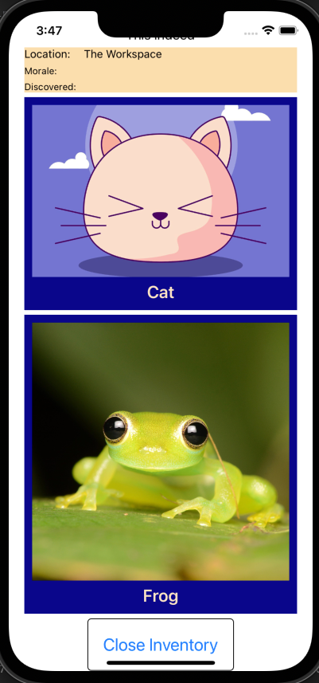
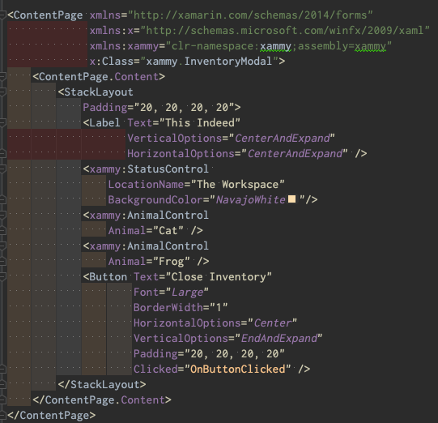
```csharp
namespace xammy
{
    [XamlCompilation(XamlCompilationOptions.Compile)]
    public partial class AnimalControl
    {
        public static readonly BindableProperty AnimalProperty = BindableProperty.Create(
            nameof(Animal),
            typeof(string),
            typeof(AnimalControl),
            string.Empty
        );
        
        public static readonly BindableProperty AnimalUriProperty = BindableProperty.Create(
            nameof(AnimalUri),
            typeof(string),
            typeof(AnimalControl),
            string.Empty
        );
        
        public string Animal
        {
            get
            {
                switch ((string)this.GetValue(AnimalProperty))
                {
                    case "Frog":
                    {
                        this.SetValue(AnimalUriProperty,
                            "https://i.etsystatic.com/isla/910f97/34229353/isla_fullxfull.34229353_lywq3bgq.jpg?version=0");
                    }
                        break;
                    case "Cat":
                    {
                        this.SetValue(AnimalUriProperty,
                            "https://www.dailypaws.com/thmb/nwNtJnMRSJ33nbdzrdsRwSJHMfU=/1500x0/filters:no_upscale():max_bytes(150000):strip_icc()/anime-cat-names-1204854078-2000-d34f509ae54943d8b78cfb4bf9ba0678.jpg");
                    }
                        break;
                    default:
                    {
                        return null;
                    }
                        break;
                }
                return (string)this.GetValue(AnimalProperty);
            }
            set
            {
                this.SetValue(AnimalProperty, value);
            }
        }

        public string AnimalUri
        {
            get => (string)this.GetValue(AnimalUriProperty);
            set => this.SetValue(AnimalUriProperty, value);
        }
        
        public AnimalControl()
        {
            InitializeComponent();
        }
    }
}
```
  - This is NOT the ideal solution because `AnimalUri` is publicly exposed. There are ways around this supplied by Xamarin,
but I didn't get them working.

- MVVM
  - The video player does not need a model. A model exists as a store or state holder for whatever uses it.
  The video player does not need this because whatever Model (AdvertisingVideo, TutorialVideo, VideoModality)
  is associated with the video player already has its own model. The video player just needs to read and populate
  a couple things from those models, then set its own properties like Uri to play the video).
  - `BindableProperty` allows you to create your own properties. ~~It's very "library-ish."~~ ACTUALLY, the pattern
  is firmly set in creating a custom control in Xamarin. Even `Button` elements have `BindableProperty` properties.
  - `base` allows you to call a method or access a property from a base class.
- Build
  - Local build was bugged in xammarin. I had to delete the `bin` and `obj` folders in the project directory. These
  folders can hold onto old build data which can cause problems.
- Progress Bar
```csharp
protected override void OnPropertyChanged(string propertyName = null)
    {
      if (
        propertyName == TotalProgressProperty.PropertyName
        || propertyName == CurrentProgressProperty.PropertyName
      )
      {
        base.OnPropertyChanged(nameof(this.Progress));
      }

      base.OnPropertyChanged(propertyName);
    }

    public double Progress =>
      this.TotalProgress == 0 ? 0d : (double)this.CurrentProgress / this.TotalProgress;
```
- CSharp
  - Casting: `(int)someDouble` will cast a double to an int. Type coercion is different because it happens automatically like in JavaScript
    ("32" * 2 = 64).
  ```csharp
      public bool IsProgressVisible
    {
      get => (bool)this.GetValue(IsProgressVisibleProperty);
      set => this.SetValue(IsProgressVisibleProperty, value);
    } 
  ```
    - Here, `(bool)` is cast because the property may actually be `null`.

## October 30 - November 3

- Thinking
  - Bloom's Higher Order Thinking
    - Synthesize - Solved a need I had by writing a terminal script. "Synthesizing" (Bloom's) serval concepts and tools into something new and effective!
    - Evaluate - Quickly identified the major challenges of pulling a chunk of code out of our app. "Evaluate" on Bloom's.
    - Understand - Got to "tour" pipeline optimization, extracting a video player to make a sharable package, debugging java tests. "Understand" on Bloom's.
  - Types of Questions I asked myself this week
    - "There hast to be a better way to do this. What tools do I have that might solve this? How can I combine those tools in novel ways to solve this."
    - "This code has a purpose. Where is it doing something that is extraneous to its purpose? How can I separate those concerns to create an optimally portable product.
    What is the tradeoff for refactoring this? Does the refactor introduce more complexity than it solves? Who has better 
    insight into this complexity problem and can speak to it."
- Command Line
  - grep and pipe
    - `grep` searches for a string in a file. `grep "string" .` searches recursively in the current directory.
    - `|` pipes the output of one command into the input of another. `grep "string" . | grep "another string"` 
    - use case: `git branch | grep "string"` to find a branch with a particular string in it.
  - Came up with a cool cd/search alias thingy. Below is the code for zshrc file
```
function cdfind() {
    local results
    results=($(ls -d *$1* 2>/dev/null))

    if [ ${#results[@]} -eq 0 ]; then
        echo "No matching directories found."
    elif [ ${#results[@]} -eq 1 ]; then
        cd "${results}"
    else
        PS3="Select a directory: "
        select dir in "${results[@]}"; do
            if [ -n "$dir" ]; then
                cd "$dir"
                break
            else
                echo "Invalid selection."
            fi
        done
    fi
}

alias cdfind='cdfind'
```
Result:
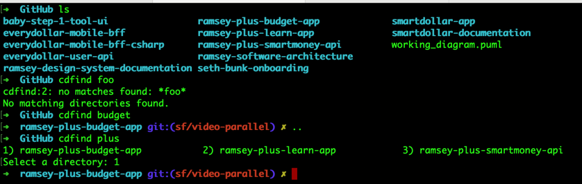

- Pipelines
  - No need to lint in QA since that's done in our PR pipeline.
  - Android typically packages with APK, but we are using AAB which is a newer format. Faster and adds features like Quick Install.
  - Our QA pipeline takes about 40 mins to build which means QA has to wait around for something to test. Optimizing this is important.
  One approach is to build a stripped down essentials-only version for QA, the when it's approved roll it up to a pre-prod build.
  - Mobile apps require a full application build to deploy. This is different from web apps which can be deployed in pieces.
- Testing
  - You don't write tests for packages you're working with unless you want to see how they work to ensure everything goes the way you think it should.
  Then you should probably remove the tests.
- Big O Awareness: How efficient an algo is. It refers only to the biggest, most complex factor in the algo.
For example: 3x^2 + 5x + 3. Big O is O(n^2) because the x^2 is the biggest factor.
  - Bubble Sort
    - Compares pairs of neighboring entries and moves them down toward the right. Then iterates again, and again all the 
    way through until no more swaps can be made meaning the list is sorted.
  - Insertion Sort
    - Begins with an array of one entry which means it is sorted. Looks at the next item and compares it to the array 
    right-most first and inserts it into place.
  - Merge Sort
    - All items are pulled into arrays containing a single item, then they at stitched back together in order.
    This helps with the worst case scenario where the starting array is in half disorder to reverse order. JavaScript.sort
    uses merge sort under the hood.
  - Quick Sort
    - A pivot (final item) is chosen. Remaining items are split in the middle to two arrays.
  - Radix Sort
    - Sorts by the least significant digit first, then the next, and so on (ones place then tens and so on). Never compares
    any item to any other item.
  - Binary Search
    - For a sorted array, split down the middle. Check left and right then split again.

## October 16-20
- Debugging
  - Successfully finding the zone a bug might be by thinking about it.
- Cross-team collaboration
  - Connecting with Av shed light on problems I was dealing with.
- Strong vs. Dynamic type
  - I ran into some bugs this week that had to do with C#'s strong typing. I see how important it is for a language to require strong typing.
  However, I kept wondering if Ruby would have put me through worse pain or whether it would have been easier or harder to debug because of its dynamic nature.
  Jury is still out on this, but it really made me wonder. 🤔
- Work
  - Discovery on `created_at` date for users. I met with Av, and captured our best ways forward here: https://github.com/lampo/ramsey-plus-budget-app/issues/2826. We probably have to work with Jenny Lee on what she actually wants to show users and how committed we are to sorting that out.
  - Ceramics – Rebuild the BabyStepClient from scratch. Luke thought I could do this in 2 hours…and he was right much to my surprise! 😮  I got the core client together in 2 hours. I spent another 4 hours building a bare bones implementation and debugging my code…most of that 4 hours was watching my emulator reload. 😆
    - Branch here: https://github.com/lampo/ramsey-plus-budget-app/pull/2851
    - Tech Doc: https://github.com/lampo/ramsey-plus-budget-app/issues/2831

## October 9-13
- IDE things
  - Interactive rebasing opens a file which can be overwritten. It runs when saved and closed. Pick/drop/squash/rename.
  - I can get a commit back even after I've squashed it. Just `git reflog`, find the hash, and check it out. Came in very handy.
  - Using breakpoints in debugging can allow you to run code (didn't know that) as well as check the values of things.
  - In IDE, Git>Local History or Git>Git History are so valuable to see how a file has changed or evolved. Life saver.
- Shipping value
  - means a lot of different things in different contexts...
  - For FPU3.0, we want to ship a minimum viable product to the customer as soon as possible to prove value and get data.
    - Therefore, we just need a quickly built platform, slapped together without writing many tests, not refactoring code into a pristine design
    so that we can enable speed in tiny R&D wins. We don't expect our platform to be around for a very long time.  
    The consequence is that the larger the app gets and the more integrated our code becomes, things will start to go 
    wrong or become to unwieldy. That's an acceptable risk right now because we will not fully flesh out this code. Instead, 
    it is just enough to gain what we need for a more stable product.
  - In SmartDollar, we want to ship new finalized features as fast as possible in response to user feedback.
    - This means we want to take the time to make sure our platform is rock solid, so that we can build new features quickly.
    To make sure our platform is solid, there is always refactoring, tests, and documentation. We intend for our platform to
    be around for a very long time.

## October 2nd - 6th
- EveryDollar
  - Awareness of E$'s startup flow, how the singletons are initialized, and the order that clients are setup. Some cool patterns in there.
- OOP
  - In Ruby, attr_readers are about encapsulation. I didn't realize that its essentially wrapping the variable in a method.
  - Circular dependency is ugly. Not sure exactly how to fix it yet.
- Workflow
  - I really broke my rule and tried to quickly do something without understanding it first...trying to implement the client built
  without taking the time to figure out how the other clients are implemented. I should have taken the time to understand how they are 
  implemented, and then sit down with my mentor to discuss different approaches to get a quick win out of it.

## September 25-29
- C#
  - Constructor overloading: Set up multiple constructors for a class, each with different parameters. When you instantiate it, pick which parameters
  to pass, and it will instantiate with the correct constructor. A use-case for this is returning an object from a network call.
  The call might result in a successful response or an error. You can set up two constructors, for for success and one for error.
  - Partial Classes: Class definition is broken up into multiple files. Good for separating concerns.
- Confidence: Client Setup in EveryDollar ([GitHub design doc](https://github.com/lampo/ramsey-plus-budget-app/issues/2713))
  - [`dotnet-apiclient-base`](https://github.com/lampo/dotnet-apiclient-base/blob/master/README.md) is a library we use to shape up the HTTP requests and responses to/from APIs.
  - Client: `BabyStepClient` [Design Doc for this Feature](https://github.com/lampo/ramsey-plus-budget-app/issues/2737)
    - 🗣️ Builds the request using the `ApiClient` library. Creates at Task then implements `HttpRequestMessage` builder. Returns result using `result.ToResult()`.
    - ❓ Why does my intellisense not pick up `SendAsyc` and `ToResultAsync` from `ApiClient.Core`??? 
    **I hadn't defined the other partial for that class which inherits from `ApiClient`**
  - Interface: `IBabyStepClient`
    - 🗣️ Simply mandates that the Client is created with the HTTP request method which takes `CorrelationVector` and `CancellationToken` as parameters. 🖊️ The `UserFinalizeClient` takes in an Auth0Token and passes it the the URI ~which is what I need to do for UserProfileBasic.~ **Actually, I just need AXID, not auth token**
  - Shared: `BabyStepClient.shared` ???
    - 🗣️ This defines the other part of the `partial UserProfileBasicClient` class using the `ApiClient` helper methods. Seems like I need to use:
      - `BabyStepConfig` from my class
      - `IRetryPolicy` from `ApiClient` to attempt calls again if there are errors.
      - `IApiClientLogger` from `ApiClient`. Not sure what this does
      - `IUserAgentAttributesProvider` from `ApiClient`. Not sure what this does
      - `HttpMessageHandler` from `IDisposeable`.
      - `Func<string> jwtTokenProvider` not sure if this is needed, but it may be used to get through to a service that requires authorization.
  - Result: `UserProfileBasicResult`
    - 🗣️ Creates a Result object using constructor overloading which holds the success, status code, and data returned. ❓ Not sure how this is called or whether the resulting object is used as the primary data source.
  - Config: `BabyStepConfig`
    - 🗣️ A standardized configuration for setting hostname, port, default timeout properties.
- Learning Process
  - When churning, pick up a pen and write something or draw something. I think of it like checking the map of the problem.
    - Write down where you are, where you've been, and where you want to go.
    - Where you are: Write down what you know.
    - Where you've been: Write down what you've learned so far'.
    - Where you want to go: Write down the minimum requirements to get what you need or all questions you have about that place.

## September 18-22
- Removing Blockers
  - Given I am generically blocked...
    - Check low-level (typos, parameters, imports, logic)
    - Check mid-level (error logs, patterns, dependencies)
      - Look for info outside my IDE (docs, google, ChatGPT)
    - Reassess what I know and what questions I have (diagram, write, take a walk)
    - Explain the problem to a peer to get insight (not an answer) from a peer.
    - Learn what I need to learn to solve the problem.

## September 11-15
- Database
  - My db still needed the viewmodel as the go-between. In fact, I didn't really have to do much refactoring
  of the viewmodel at all. I just had to do a db call when newing up the Items object in the viewmodel.
  - The database may not be writing to disc which is why it looks like it loses data after rerunning the app after closing.
  - Found it! 

In the View:
```csharp
        private void AddItemToInventory(int selectedOptionIndex)
        {
            if (selectedOptionIndex > 0)
            {
                Item selectedItem = this.viewModel.Items.FirstOrDefault(item => item.Id == selectedOptionIndex);
                
                selectedItem.Status = Item.ItemStatus.Obtained;
                
                ItemsViewModel.UpdateItem(selectedItem);
            }
        }
```
In the ViewModel:
```csharp
        public async Task UpdateItem(Item item)
        {
            await Database.UpdateItem(item);
        }
```
In the `Database.cs` file:
```csharp
        public static async Task UpdateItem(Item item)
        {
            await InitializeDb();
            
            await dbConnection.UpdateAsync(item);
        }
```

## September 4-8
- Database
  - async will look for await and run them even if they are in an assignment statement.
    - `var id = await db.InsertAsync(briefcase);` the method will go to assign id, but runs into the `await`, so it runs the `await`, then comes back and finishes the assignment. So the 
  - Theres a real gap between my concept and the implementation in Xamarin. It's really convoluted compared to Javascript/React.
  - I'm also not able to take the basic implementation and turn it into something more complex yet.

## Aug 28 - Sept 1
- Database in XF app
  - Installing SQLite in project ~~SQLite.Net-PCL is compatible with Xamarin.iOS.~~ Nope. Needed `sqlite-net-pcl` instead.
  - Surprisingly, initializing the database on app load is smart. It will only initialize once, then ignore subsequent initializations (which would wipe the previous state of the database).
  - `Path.Combine` is a simple way to build a platform-agnostic path to the database.
  - `DependencyService.Get<ISQLite>()` is a way to build platform-specific paths to the database.
  - Dont install deprecated database packages. 😎
  - Not sure how to reference the database which is pretty perplexing.
- C#
  - Awareness: "interface" is like an archetype for a clas. It has "contracts" which are public methods and properties that must be implemented by any class which implements the interface.
  - Awareness: "contract" is a public method or property which must be implemented by any class which implements the interface. It's called a contract because it is a hard and fast rule which must be carried out for the class to be valid.
  - Confidence: Build a simple Interface.
- Xamarin.Forms
  - SafeArea is set on the page, not on a view... Component lifecycle makes this sticky.
  - Since SafeArea cannot be set on a view, I had the idea to read the dimensions of the SafeArea and pass it along to set the padding of the video to make it full screen.
  - With a CDN setup, we are serving our pages as HTML delivered from the database. Xamarin does not like to render images from URLs delivered by HTML. Need a workaround.
  

## August 21-25
- C#
  - Confidence: Creating a new page and wiring it up to a button click.
  - Confidence: Creating a new modal and wiring it up to a button click.
  - Confidence: Creating a new ViewModel and wiring it up to a page.
  - Confidence: Creating a new View and wiring it up to a ViewModel.
- Teamwork
  - Confidence: Break down problems in their essential and accidental complexity.
  - Awareness: Team cohesion and morale is just as important as the "What" concerns.
  - Awareness: Nailing down the language and terminology is incredibly important, but easy to overlook. I need to drive for clarity on language more.

## August 14-18
- Indexing Files 
  - You have to index files in the IDE if you drag/drop them into the folder manually.
- Xamarin
  - Confidence: Creating Click Events which lead to new pages and modals.
  - Confidence: turning on/off navigation bar and tab bar in the Shell.
  - Confidence: Connecting a ViewModel to a View with a BindingContext (supplied in the code behind).
  - Confidence: Various UI controls and their properties (Entry, Label, Button, Picker, Modal, etc.)

## August 7-11
- C
  - Learned how to build/compile in C. My key takeaways are in /c/c-learning.md
- Java
  - IntelliJ IDEA automatically sets up Maven.
  - Java reminds me of NodeJS.
- Postman
  - Sometimes you need an M2M token to access an endpoint. This is because the endpoint expects a machine like the BFF to access it
  rather than a user.
- every-dollar-mobile-bff
- ramsey-plus-smartmoney-api
  - an api which utilizes a database.
  - run a local database by running `docker-compose up` in the root directory. (Make sure Rancher is running first).
  - then run the api by hitting the debug button in IntelliJ.
  - In Postman
    - Generate a M2M (machine to machine) token.
    - Use that toke in the Authorization > Bearer Token field.
    - test the `/actuator/health` endpoint at `http://localhost:8080/ramsey-plus-smartmoney-api/actuator/health`
    - test the `/ready` endpoint at `http://localhost:8080/ramsey-plus-smartmoney-api/ready`

## July 31-August 4
- E$Mobile integration
  - E$Mobile does not use `<ControlTemplate>` which is really unfortunate. We use that in our testflight app everywhere.
  Essentially, it means we have to build custom `controls` instead of relying on Xamarin's built-in controls for everything.
  - E$Mobile's startup flow is UUUUUUUUGLY XD
    - It is a giant switch case statement with a bunch of `if` statements inside of it. It runs a page, the page
    sets itself complete at the end, then runs thru the switch statement again. And so on.
- Optimizely
  - You can only use a flag name once...so make it REALLY specific.
- Speak up!
  - Problems I see are mostly shared problems at this point.
- C#
  - Variable declarations in switch/case statements are scoped to the entire switch statement
    "magically" unless it is enclosed in a block.
```csharp
//Scoping to the entire switch statement

switch (someVariable)
{
    case 1:
        int x = 1;
        break;
    case 2:
        x = 2; // This looks up the declaration of x in case 1
        break;
}

// Narrowing the scope

switch (someVariable)
{
    case 1:
    {
    int x = 1;
    }
        break;
    case 2:
        x = 2; // This will break because x was scoped to case 1 only using a block
        break;
}
```

## July 24-28
- Over All Learning
  - Able to wire up a brand new View, Code Behind, and ViewModel in Xamarin.
  - Able to grasp 100% of View Layer in production code.
  - Able to grasp 85% of Code Behind in production code.
  - Able to conceptually grasp 90% of ViewModel in production code, and 50% of its detailed implementation (without diagrams).
    - *Recognizing that this ViewModel layer needs a diagram was a big win for me. I think it shows where I'm recognizing genuine complexity and identifying tools which can bring clarity*
- Xamarin
  - `AbsoluteLayout` was useful in centering an item between other elements without having to use a grid.
    ```xamarin
    <AbsoluteLayout VerticalOptions="FillAndExpand">
        <ffImageLoading:SvgCachedImage
            AbsoluteLayout.LayoutBounds="0.5, 0.5, 229, 229"
            AbsoluteLayout.LayoutFlags="PositionProportional"
            Source="resource://RamseyPlusApp.Resources.Images.bank-search.svg" />
    </AbsoluteLayout> 
    ```
  - `LayoutBountds` is "horizontalPositionPercentage, verticalPositionPercentage, horizontalSize, verticalSize"
- Ruby vs C#
  - Rails:
  ```ruby
  x = y = z = "howdy"
  
  puts x
  
  # => "howdy"
  ```
  - C#:
  ```csharp
  string x;
  string y;
  string z;
  
  x = y = z = "Howdy";
  
  Console.WriteLine(x);
  
  // => "howdy"
  ```
## July 17-21
- RamseyInHouse
  - I got a JavaScript project pulled down to improve and work on documentation next week.
  - I learned that Node Modules generally won't run on a local server without Webpack.
- Design
  - Don't make direct changes to your Model from the View layer!

## July 10-14
- C#
  - nullable returns from methods or variables is possible if the type declaration is
  appended with a question mark. This allows the return to be `null` whereas c sharp typically
  defaults to non-nullable types.
  ```csharp
  public string? UserName(name)
  {
  return name
  } 
  ```
  in this case, if the user never enters a name, the method will still return, but it will return `null`
instead of an error.
- Debugging
  - Steps to figure out where a bug came from (login failed)
  - Using breakpoints in IDE to pause code and step through it line by line to see where the error happens.
- 

## July 3-7
- Tech Design (two instances)
  - Helped determine the right path forward.

## June 26 - 30

- Full Stack
  - Seed Rails database with `has_and_belongs_to_many` association.
  - `<select>` to grab a particular item out of a database
  - render that item in a partial.

*Accelerated Learning Methods*
1. Working Ramsey my pace (solo, pair as needed) 
2. Make a problem to work on (personal project, patterns)
3. Hackerrank
4. Teach / Present

*Slower Pace*
5. Reflecting
6. Shadow (watch)
7. Researching
- Priorities
  - Seth best serves the team by learning code.
  - Sniper metaphor from Eli (Don't leave the rooftop)
- Language
  - C# constructor is a method named after the class
  - Generic type parameters `class Inventory<T>` allows your class to receive a variety
  of objects of any kind. The type is specified at (compile time???).
  - `List<T>` is a generic class which is a collection of elements of various types.
  It offers handy methods like `Add`, `Remove`, `Sort` and also implements some interfaces
  like `IEnumerable<T>`, `ICollection<T>`, and `IList<T>`.
  - Pascal case for method and class names. Camel for parameters and variables.
- Process
  - Tech Design EVERY PROBLEM before sitting down to code.
  - Diagram
- Pattern
  - [Lots of Learning Here](https://github.com/lampo/ramsey-plus-budget-app/pull/2479/files)
  

## June 5 - 9
- Team
  - We need to spend more time together doing:
    - Decomp
    - Talking about state management in Xamarin
- Data
  - Access local storage and reset it: https://github.com/lampo/ramsey-plus-learn-app/pull/2078/files
- Environment
  - Download new Xcode version (cuz emulator was messed up)
  - Point IDE to Xcode and point Xcode to a correct version of its own app.
- Xamarin
  - Recognize and distinguish View and ViewModel code and articulate the purpose for each. Articulate a code-behind.

## May 30 - June 2
- Maui
  - Front end library stuff
  - Data Binding in XAML can two-way (view<->model) or one way (view<-model), but Maui can detect this so it doesn't need to be manually set.
  - Network calls.
  - Platform APIs (battery, notifications, keyboard)
  - Navigation using the Shell
  - `ResourceDictionary` and `SetterProperty` make styling standard across the app.
  - `OnPlatform` can assign custom styles based on the platform it is implemented on.
- A bunch of other minutiae that that I didn't capture (especially about setting up a machine and an IDE).

## May 22 - 26
- Dev environment
  - It's important to document dev env setup.
- Design Patterns
  - Confidently evaluate the implementation of a Decorator pattern.
  - Confidently whiteboard a Decorator pattern.
  - Confidently refactor a decorator pattern.

## May 15 - 19

- Design Patterns
  - Confidently explain 
- Languages
  - Awareness of some of C#'s distinguishing characteristics
    - Strongly typed language
    - OOP
    - .Net is a framework which can compile many different languages (including and primarily C#) for use on a variety of platforms such as Windows, Linux, and MacOS)
    - overflow as an issue
    - variables can be set inside a function and passed back up through the argument and used outside a the function
```
static void ReturnVariable(int parameter, out int variable)
{
  variable = parameter + 100
}

static void Call()
{
  int variable;
  ReturnVariable(900, variable)
  Console.Write("variable is now {0}", variable)
}

Call() => variable is now 1,000
```
  Even though `ReturnVarialbe` is `void` (meaning it returns nothing),
  the variable can be set within itself and is passed back out.


## May 8 - 12
- Testing
  - Confidently find existing stubs and apply them as needed. _Hello_ `stub_debt_snowball`.
  - Confidently explain that stubs allow us to fake a response from an external API. 
  - Confidently use and explain what Capybara allows us to do (simulate a user interacting with a rendered component)
  - Confidently get annoyed with Capybara not providing a way to see why a `.has_text` test failed 😆
    - Throwing in a `binding.pry` helps.
  - Confidently interact with features hidden behind flags and 1:1 Coaching.
    - Enable/disable proper flag
    - `app/models/product_variant/base.rb`
      ```
      def can_access_one_on_one_coaching?
        # !!Current.coaching_organization.max_bookings.nonzero?
        true
      end
      ```
- Design Patterns
  - Awareness of how a decorator adds functionality to an object by wrapping it to dynamically add methods.
  - Confidently know why our Baby Steps need to have a decorator build them! It helps to smooth out the nasties in our monkey patch.
- Refactoring
  - Confidently identify the need for a refactor of our `BabyStepGoalDecorator` and propose a feasible solution.

## May 1 - 5
- Data
  - Awareness of how to sus-out the data I need using existing features.
  - Awareness that sometimes objects contain methods that aren't easy to find. 
  - Factory to build our BabyStep classes out into their own thing.
- Testing
  - Confidently articulate Arrange, Act, Assert
  - Awareness of how and why to stub data for network calls.
  - Awareness of different [RSpec expectations](https://github.com/rspec/rspec-expectations) 
- OOP
  - Awareness that Ruby's seemingly "typed" language is actually a facade. Exampe, `String` type is actually just a class that can be modified like any other.
  - Awareness that this means, our Ruby apps are essentially programming languages in themselves.
- Patterns
  - Monkey Patch. We bring an SDK/gem in, but redefine some of its methods in our app. Sharp knives...generally a bad idea. Best idea is to patch the SDK and bump the version so all the world can share.


## April 24 - 28
- Design Patterns
  - Confidently use and explain Strategy Pattern: [Two examples I wrote here](https://github.com/SethFaerber/mentoring/blob/main/design-patterns/strategy_pattern.rb).
  - Confidently use and explain Singleton Pattern: [Two examples I wrote here](https://github.com/SethFaerber/mentoring/blob/main/design-patterns/singleton_pattern.rb).
  - Awareness of `super` keyword: [Example I wrote here](https://github.com/SethFaerber/mentoring/blob/main/design-patterns/super.rb).
- Styling
  - Confidently use new RDS Components (Link, Grid, etc.)
- Data
  - Confidently include and use helpers where needed `BabyStepsHelper` for example.
  - Awareness of using named parameters, and doing API calls in the instantiation.
    - `<%= render(Dashboard::BabyStepProgressCardComponent.new(baby_step: Api::BabyStep.current, goal: "76")) %>`
  - `object&.method` just in case the method returns `nil`.
  - Awareness of `delegate` concept
  - Awareness of `RequestStore` gem
- Git
  - Awareness of the concept of `checkout` to revert files I don't want changed in my PRs such as `db/schema.rb`.

## April 17 - 21
- Git
  - Awareness of dealing with merge conflicts
  - Awareness of `git` best practices
    - Create Draft PR right away
      - Gives visibility to your changes
    - Rebase early and often to avoid merge conflicts
      - `git fetch` to grab remote changes
      - `git rebase origin/master` to set my local branch at the head.
    - Squash commits into a single PR
      - `git rebase -i HEAD~number_of_commits_plus_one` `-i` opens IDE to edit commits. `f` to squash a commit into another. `r` ???
      - `git rebase --continue` if needed
      - `git push --force` to force the newly squshed local commit to overwrite the remote.
      - "vim" r character replace.
      - 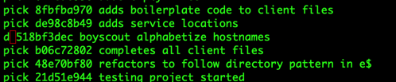
    - Let's say you have a local branch and want to merge it into your local main. 
      - *** THIS IS BAD FOR PROD! ONLY TINY LOCAL PROJECTS ***
      - Squash all previous commits together on the working branch.
        - `git rebase -i HEAD~number_of_commits_plus_one`
        - `squash` for every newer commit that you want to lay on top of the previous one. So if you want all the commits,
        it will look like:
        - pick xxxxxxxx My first commit on this branch
        - squash xxxxxxxx My second commit on this branch to be laid on top of the original
        - squash xxxxxxxx My third commit on this branch to be laid on top of the original
      - Set the working branch to the head of the main branch.
        - `git rebase main -i`
        - Conflicts will show up in the IDE. Fix them, save and close.
      - Now your branch is set at the head, and main can fastforward to it
        - `git checkout main`
        - `git merge working_branch`
      - Now `main` has received the entire working branch.
- Migrations
  - Confidently create release flag and accompanying `features.yml` (which automatically sets up flags for new devs)
- Testing
  - Awareness of mocking Api calls in tests.
- Design Patterns
  - Confidently articulate the purpose and use cases for Factory Pattern
  - Awareness of how to build a factory pattern
  - Awareness of factory patterns in S$ app
- Oddity
  - `.presence` returns an object or `nil`.
  - Assignment operator `=` can be used in an `if` conditional to assign or else evaluate falsy.
  - Combine these two
    - `if (object = other_object.presence) { object }` returns the newly assigned object or else evaluates falsy.

## April 10 - 14
- Styling
  - Confidently use RDS Design Tokens for Styling
  - Confidently add a new `.scss` file and IMPORT IT 😅
- Data
  - Confidently add dynamic data to YML text.
  - Confidently find user data I'm looking for like `User.current_user.created_at`
- Git
  - Confidently know that merge conflicts suck 😮‍💨
  - Awareness of git workflow with multiple people working on similar files simultaneously.

## April 3 - 7
- Active Record
  - Confidently use Rails Console to interact with Active Record.
  - Confidently write Active Record queries to create and associate records.
  - Confidently seed database.
  - Awareness of `has_and_belongs_to_many` association ( like students to teachers)
  - Awareness of writing migrations to assocaite models with each other.
  - Awareness of rolling back a migration when a mistake is made `rails db:rollback`
- RDS
  - Confidently install RDS gems.
  - Awareness of using installed RDS Components in our app.
  - Awareness: Hunted down and joined RDS Teams channel and reached out to Grant for assistance.
- Documentation
  - Confidently add to documentation in other repos (RDS docs PR: https://github.com/lampo/ramsey-design-system-documentation/pull/480)
  - Awareness of how to find docs in various repos.

## May 27 - 31

- Version Control:
  - Confidently clone, branch, checkout, commit, and merge in other repos.
  - Awareness of git cherry-pick and how it could have helped me with a broken branch.
- Dependencies
  - Confidently find and follow documentation on migrating dependencies.
  - Confidently yarn remove/add @version
  - Confidently test as I go... yarn test/build/start
  - Confidently determine if a dependency is a "dependency" or a "devDependency"
  - Awareness of debugging problems
    - Reading error logs
    - Finding solutions online and implementing them
    - Reverting versions
- PRs
  - Confidently make small PRs (learned this the hard way).
  - Awareness of commenting head-tilts
  - Awareness of responding to comments in a helpful way
  - Merging
- Pipeline
  - Awareness of some the tools the pipeline uses to check the code (linters)
  - Awareness that we use our own inhouse linters (@ramseyinhouse)...and they are out of date ;)
